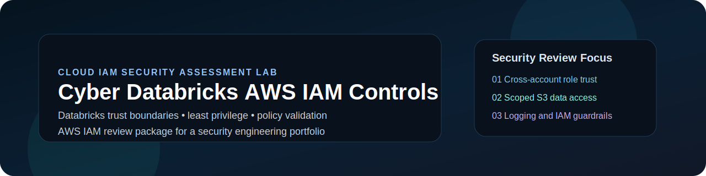
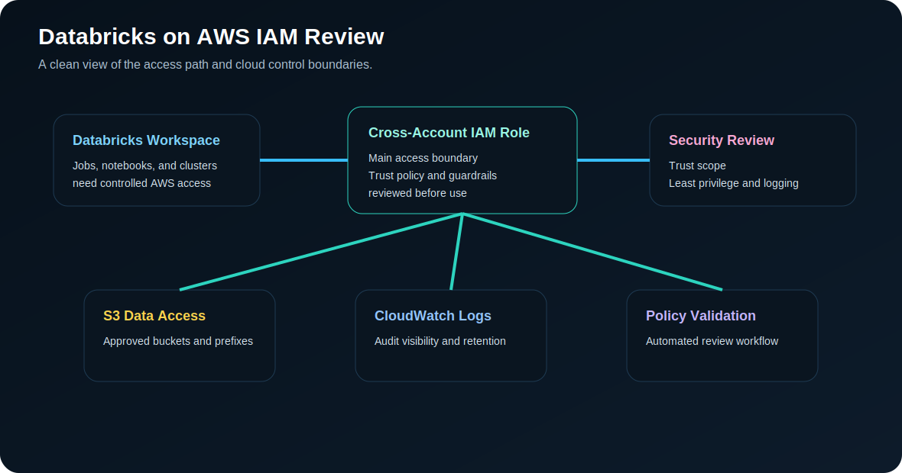

<p align="center">
  
</p>

<p align="center">
  <a href="#overview">Overview</a> •
  <a href="#my-approach">My Approach</a> •
  <a href="#security-review-diagram">Diagram</a> •
  <a href="#what-this-project-covers">Coverage</a> •
  <a href="#repo-contents">Repo Contents</a> •
  <a href="#skills-highlighted">Skills</a>
</p>

---

## Overview

**Cyber Databricks AWS IAM Controls** is a portfolio project built to showcase how a Databricks deployment on AWS can be reviewed from a **cloud IAM security** perspective.

This project focuses on the most important access-control and security-review areas, including:

- **Cross-account IAM trust relationships**
- **Least-privilege S3 access**
- **CloudWatch logging permissions**
- **Permission boundaries**
- **IAM policy validation and security review workflow**

Instead of looking like a generic lab, this repository is structured like a **real cloud security engineering review package**.

---

## My Approach

I built this project around the way I would look at a real Databricks access review in AWS. I did not want it to just be a few sample IAM policies sitting in a repo. I wanted the project to show the thought process behind the security review: who is allowed to assume the role, what data the role can reach, how logging is protected, and where risky permissions should be restricted.

The idea was to make the project practical and easy to explain. Each part connects back to a real review question a cloud security team would ask before approving access. The IAM policies show the control design, the Terraform shows how the role could be modeled, the documentation explains the risk areas, and the Python validator shows how some of the review can be automated.

---

## Security Review Diagram

<p align="center">
  
</p>

---

## What This Project Covers

| Review Area | Purpose | Example Artifact |
|---|---|---|
| Cross-account trust | Restrict who can assume the Databricks role | `iam-policies/databricks-cross-account-role-trust-policy.json` |
| Data access control | Limit S3 access to approved buckets and prefixes | `iam-policies/least-privilege-s3-access-policy.json` |
| Logging integrity | Allow logging while protecting audit evidence | `iam-policies/cloudwatch-logs-access-policy.json` |
| Privilege escalation prevention | Block high-risk IAM and admin actions | `iam-policies/restricted-admin-boundary-policy.json` |
| Policy validation | Detect risky patterns in IAM policies | `scripts/validate_databricks_iam.py` |

---

## Repo Contents

```text
Cyber_Databricks_AWS_IAM_Controls
│
├── assets/
│   ├── cyber-databricks-banner.svg
│   └── iam-security-review-diagram.svg
│
├── iam-policies/
│   ├── databricks-cross-account-role-trust-policy.json
│   ├── least-privilege-s3-access-policy.json
│   ├── cloudwatch-logs-access-policy.json
│   └── restricted-admin-boundary-policy.json
│
├── terraform/
│   ├── main.tf
│   ├── variables.tf
│   └── outputs.tf
│
├── scripts/
│   └── validate_databricks_iam.py
│
├── docs/
│   ├── assessment-checklist.md
│   ├── control-mapping.md
│   ├── threat-model.md
│   └── remediation-guide.md
│
└── .github/workflows/
    └── iam-policy-scan.yml
```

---

## Quick Review Flow

1. Review the **trust policy** for the Databricks access path.
2. Review the **S3 access policy** for least privilege.
3. Review the **CloudWatch logging policy** to preserve audit visibility.
4. Review the **permission boundary** for escalation control.
5. Run the **validation script** to scan for risky IAM patterns.

```bash
python scripts/validate_databricks_iam.py --policy-dir iam-policies
```

---

## Skills Highlighted

- AWS IAM security design
- Databricks security review
- Cross-account trust policy analysis
- Least-privilege S3 access design
- Permission boundary implementation
- CloudWatch logging protection
- Python-based policy validation
- Terraform IAM modeling
- Security documentation and assessment workflow

---

## Project Value

This project shows how cloud security review can be turned into a repeatable engineering workflow. It combines IAM policy design, infrastructure-as-code, documentation, and automated validation so access decisions are easier to review, explain, and improve.

A reviewer can use this repo to understand:

- how Databricks access to AWS can be scoped through IAM,
- how S3 and logging permissions can be separated by purpose,
- how permission boundaries reduce escalation risk,
- how security documentation supports audit and governance conversations,
- and how policy validation can catch risky access patterns before deployment.

## Real-World Use Case

In an enterprise environment, this type of review would help security teams evaluate a Databricks workspace before broader adoption. The same pattern can support cloud service onboarding, access reviews, control mapping, and secure data platform governance.
