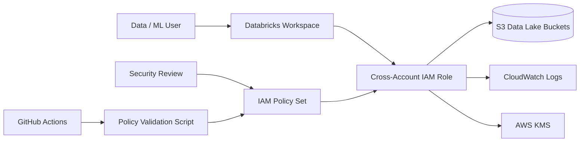

<h1 align="center">🔐 Cyber Databricks AWS IAM Controls</h1>

<p align="center">
  
  
  
  
  
</p>

## Overview

This project demonstrates how to design IAM controls for a secure Databricks deployment on AWS. It focuses on least privilege, cross-account role trust, S3 data access boundaries, logging permissions, permission boundaries, and policy validation.

The goal is to show practical cyber cloud security work that maps to real enterprise concerns: preventing over-permissioned access, reducing blast radius, protecting data lake storage, and giving security teams a repeatable review process.

## Use Case

A security team is reviewing a Databricks workspace that needs access to AWS resources such as S3, CloudWatch Logs, and supporting IAM roles. The review focuses on making sure Databricks can perform required work without granting broad administrative access.

## Architecture



## What This Project Includes

| Area | Files |
|---|---|
| IAM trust controls | `iam-policies/databricks-cross-account-role-trust-policy.json` |
| S3 least privilege | `iam-policies/least-privilege-s3-access-policy.json` |
| Logging access | `iam-policies/cloudwatch-logs-access-policy.json` |
| Permission boundary | `iam-policies/restricted-admin-boundary-policy.json` |
| Terraform example | `terraform/` |
| Policy validation | `scripts/validate_databricks_iam.py` |
| Control mapping | `docs/control-mapping.md` |
| Threat model | `docs/threat-model.md` |
| Remediation guidance | `docs/remediation-guide.md` |
| CI scan | `.github/workflows/iam-policy-scan.yml` |

## Key Security Concepts Demonstrated

- Databricks cross-account role trust hardening
- Least-privilege S3 data access
- IAM permission boundaries
- Deny guardrails for sensitive IAM and logging actions
- Separation of workspace access from AWS administrative access
- Policy-as-code review using Python and GitHub Actions
- Control mapping for audit/security review conversations

## How to Run the Policy Validator

```bash
python scripts/validate_databricks_iam.py --policy-dir iam-policies
```

The script reviews JSON policy files and flags risky patterns such as:

- `Action: *`
- `Resource: *`
- high-risk IAM/KMS/S3 administrative permissions
- missing trust policy conditions
- broad STS assume-role access

## Why This Looks Strong on GitHub

This is not just a basic Databricks demo. It shows cyber security thinking around identity, access control, cloud governance, and secure data platform adoption. It connects Databricks, AWS IAM, Terraform, and security controls in one portfolio-ready project.

## Disclaimer

This project uses sample account IDs, role names, and bucket names for demonstration. Replace all placeholders before using in a real AWS environment.
